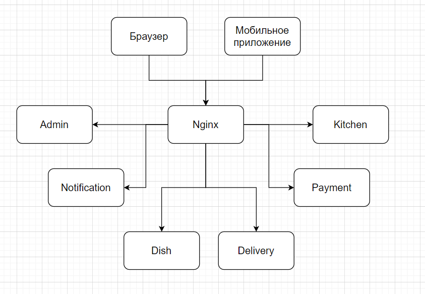

## job4j_fast_food

Задание с блока микросервиса.
Желания заказчика:
- имеет каталог блюд
- может принимать заказы клиента на сайте. Либо через скачанное клиентами приложение
- предоставляет клиенту курьерскую доставку. Клиент может контролировать положение курьера
- предоставляет курьерам приложения, где они могут отчитываться о заказах, обновлять свое положение
- имеет админку в виде веб приложения, где можно оформлять поставки продуктов, а также видеть прибыль.

Приложение будет состоять из maven моделей. Каждый модуль будет отдельное Spring boot приложение.

```
/admin/pom.xml - админка
/order/pom.xml - сервис заказов
/dish/pom.xml - сервис блюд
/delivery/pom.xml - сервис доставки
/kitchen/pom.xml - сервис кухни
/payment/pom.xml - сервис платежей
/notification/pom.xml - сервис уведомлений
/domain/pom.xml - доменные модели
```

Архитектура приложения:
